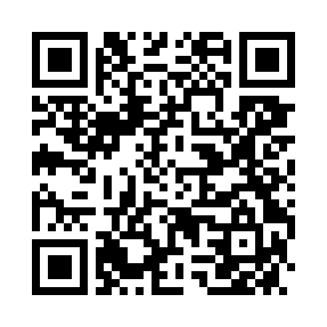

# Memory Share
 

[ここをクリックするとデモページが開きます](https://memory-share-3ab14.firebaseapp.com/)

 

 

スマホで Memory Share へアクセスするためのQRコード 
↓
 

 

# 概要
- 美しい思い出を「画像」と「文章」で記録するためのWebアプリ

 

# 使い方
1. Memory Share を開いたら、画面右上の「会員登録」をクリックしてアカウントを作成してください
2. 画面右上の「投稿する」をクリックしてください
3. タイトル、本文、画像URL (インターネット上の画像リンクのみ)　を入力して「投稿する」ボタンを押してください